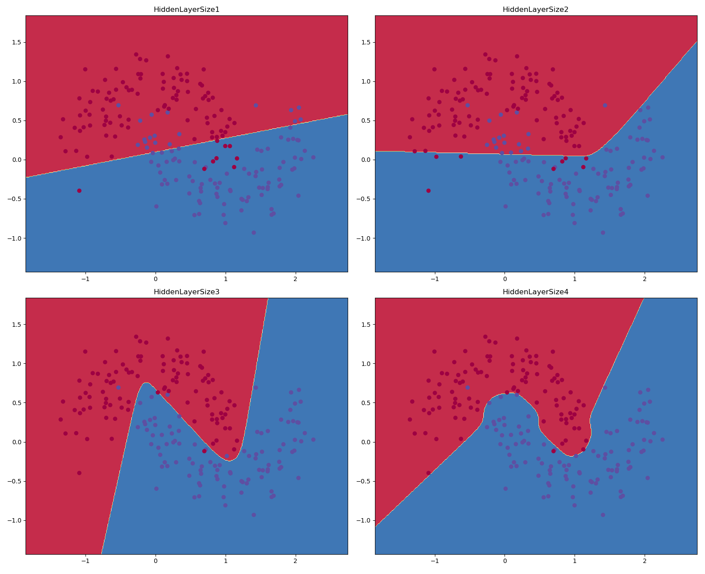

# three-layer-neural-network

 In  this  project,  the  multilayer  artificial  neuralnetwork  algorithm  implemented  with  python  language. The project
  supports 2 output and 3 output networks.
 
 #### Calculate Loss
 Cross-entropy loss applied. 
 #### Predict
 *tanh* and *softmax* activation functions used. 
 #### Build Model
 This function takes 2D input array and calculates 2D prediction vector. While building a model forward-
 propagation performed for making a prediction, and backpropagation applied to update the network parameters.
 #### Build Model 691 
 This function takes 2 input and classify 3 output labels. 
 
 #### Results
 *2D Input & 2D Output*  
 I used Moon dataset from sklearn.  
 `X, y = make_moons(200, noise=0.20)`
 
 
 *2D Input & 3D Output*  
  I used Moon isotropic Gaussian blobs dataset from sklearn.  
  `X, y = make_blobs(n_samples =100, centers=3, n_features=2, random_state=0)`

 

 *This project developed for the Machine Learning Course (CS 691) at UNR.*